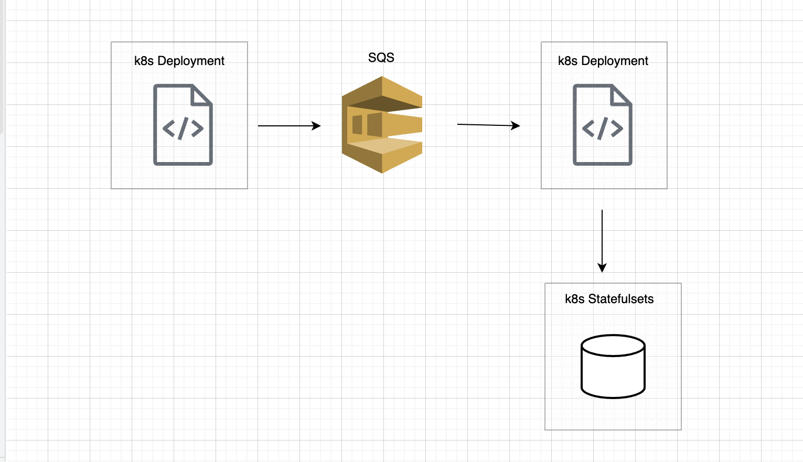

# KEDA-implementation

This project helps to understand the implementation of Kubernetes Event Driven Autoscaling. We will use two separate code source, one for producing the messages, another one for consuming those messages. In between we will make AWS SQS sit to hold those messages and any moment there is an increase in messages in a particular queue, the KEDA will autoscale the pods automcatically. In the end, the consumer will write those message to Mysql databases being deployed in statefulsets.

Below is the architectural diagram of this project.

 
